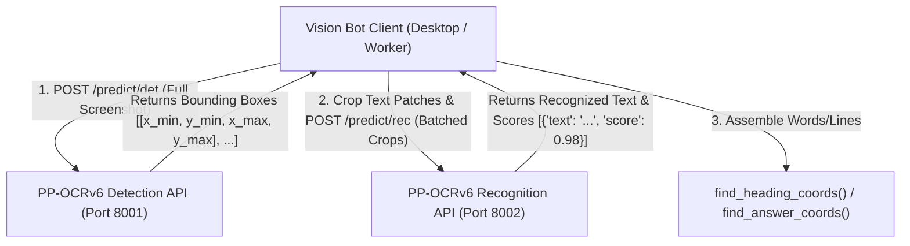

# Distributed Microservices Architecture: PP-OCRv6 Detection & Recognition APIs

This document defines the production architecture, data flow pipeline, FastAPI service schemas, Docker setup, and client integration adapter for hosting **`PP-OCRv6_medium_det`** (text detection) and **`PP-OCRv6_medium_rec`** (text recognition) as independent microservices.

---

## 1. High-Level System Architecture



### Architecture Key Principles
1. **Decoupled Workloads**: Detection (heavy GPU/CPU convolution over large screens) and Recognition (batched 1D line text decoding) scale independently.
2. **Standardized Coordinate Pipeline**: Coordinates are maintained in physical screen pixels (`Left`, `Top`, `Width`, `Height`), preserving exact visual geometry for DPI scaling and click operations.
3. **Stateless REST Interfaces**: Built using FastAPI with async threadpools for high-throughput concurrency.

---

## 2. API Specifications & Data Schemas

### A. Detection Service (`PP-OCRv6_medium_det`) — Port 8001

#### `POST /predict/det`
- **Request Format**: `multipart/form-data` (Image File) OR `application/json` (Base64 String)
- **Response Format**: `application/json`

**Sample Response (`200 OK`)**:
```json
{
  "status": "success",
  "boxes_count": 2,
  "boxes": [
    {
      "box_id": 0,
      "x_min": 340,
      "y_min": 512,
      "x_max": 425,
      "y_max": 534,
      "width": 85,
      "height": 22
    },
    {
      "box_id": 1,
      "x_min": 500,
      "y_min": 512,
      "x_max": 650,
      "y_max": 534,
      "width": 150,
      "height": 22
    }
  ]
}
```

---

### B. Recognition Service (`PP-OCRv6_medium_rec`) — Port 8002

#### `POST /predict/rec`
- **Request Format**: `application/json` (Batch of Base64 Cropped Images)
- **Response Format**: `application/json`

**Sample Request**:
```json
{
  "images": [
    "data:image/png;base64,iVBORw0KGgoAAAANSUhEUgAA...",
    "data:image/png;base64,iVBORw0KGgoAAAANSUhEUgAA..."
  ]
}
```

**Sample Response (`200 OK`)**:
```json
{
  "status": "success",
  "results": [
    {
      "index": 0,
      "text": "SW1A 1AA",
      "score": 0.9845
    },
    {
      "index": 1,
      "text": "10 DOWNING STREET",
      "score": 0.9912
    }
  ]
}
```

---

## 3. FastAPI Service Implementations

### Service 1: `main_det.py` (Detection Microservice)

```python
import io
import cv2
import numpy as np
from fastapi import FastAPI, File, UploadFile, HTTPException
from pydantic import BaseModel
from paddleocr import PaddleOCR

app = FastAPI(title="PP-OCRv6 Detection Microservice", version="1.0.0")

# Initialize PP-OCRv6 Detection Engine
det_engine = PaddleOCR(
    text_detection_model_name="PP-OCRv6_medium_det",
    use_doc_orientation_classify=False,
    use_doc_unwarping=False,
    use_textline_orientation=False,
    device="cpu",
    enable_mkldnn=True,
)

@app.post("/predict/det")
async def detect_text_boxes(file: UploadFile = File(...)):
    contents = await file.read()
    nparr = np.frombuffer(contents, np.uint8)
    img = cv2.imdecode(nparr, cv2.IMREAD_COLOR)

    if img is None:
        raise HTTPException(status_code=400, detail="Invalid image payload")

    # Run Detection
    result = det_engine.predict(img)
    boxes = []

    for res in result:
        rec_boxes = res.get("rec_boxes", [])
        for idx, box in enumerate(rec_boxes):
            x_min, y_min, x_max, y_max = [int(v) for v in box.tolist()]
            boxes.append({
                "box_id": idx,
                "x_min": x_min,
                "y_min": y_min,
                "x_max": x_max,
                "y_max": y_max,
                "width": x_max - x_min,
                "height": y_max - y_min
            })

    return {
        "status": "success",
        "boxes_count": len(boxes),
        "boxes": boxes
    }
```

---

### Service 2: `main_rec.py` (Recognition Microservice)

```python
import base64
import cv2
import numpy as np
from fastapi import FastAPI, HTTPException
from pydantic import BaseModel
from paddleocr import PaddleOCR

app = FastAPI(title="PP-OCRv6 Recognition Microservice", version="1.0.0")

# Initialize PP-OCRv6 Recognition Engine
rec_engine = PaddleOCR(
    text_recognition_model_name="PP-OCRv6_medium_rec",
    device="cpu",
    enable_mkldnn=True,
)

class RecBatchRequest(BaseModel):
    images: list[str]  # List of Base64 encoded cropped images

@app.post("/predict/rec")
async def recognize_text_batch(payload: RecBatchRequest):
    if not payload.images:
        return {"status": "success", "results": []}

    cropped_imgs = []
    for b64_str in payload.images:
        if "," in b64_str:
            b64_str = b64_str.split(",", 1)[1]
        data = base64.b64decode(b64_str)
        nparr = np.frombuffer(data, np.uint8)
        img = cv2.imdecode(nparr, cv2.IMREAD_COLOR)
        if img is not None:
            cropped_imgs.append(img)

    if not cropped_imgs:
        raise HTTPException(status_code=400, detail="No valid images to process")

    # Run Recognition Batch
    predictions = rec_engine.predict(cropped_imgs)
    results = []

    for idx, pred in enumerate(predictions):
        texts = pred.get("rec_texts", [""])
        scores = pred.get("rec_scores", [0.0])
        text = texts[0].strip() if texts else ""
        score = float(scores[0]) if scores else 0.0

        results.append({
            "index": idx,
            "text": text,
            "score": score
        })

    return {
        "status": "success",
        "results": results
    }
```

---

## 4. Docker Containerization Setup

### `Dockerfile.det` (Detection Container)

```dockerfile
FROM python:3.11-slim

RUN apt-get update && apt-get install -y \
    libgl1-mesa-glx \
    libglib2.0-0 \
    && rm -rf /var/lib/apt/lists/*

WORKDIR /app

COPY requirements.txt .
RUN pip install --no-cache-dir -r requirements.txt

COPY main_det.py .

EXPOSE 8001
CMD ["uvicorn", "main_det:app", "--host", "0.0.0.0", "--port", "8001", "--workers", "4"]
```

### `Dockerfile.rec` (Recognition Container)

```dockerfile
FROM python:3.11-slim

RUN apt-get update && apt-get install -y \
    libgl1-mesa-glx \
    libglib2.0-0 \
    && rm -rf /var/lib/apt/lists/*

WORKDIR /app

COPY requirements.txt .
RUN pip install --no-cache-dir -r requirements.txt

COPY main_rec.py .

EXPOSE 8002
CMD ["uvicorn", "main_rec:app", "--host", "0.0.0.0", "--port", "8002", "--workers", "4"]
```

### `docker-compose.yml`

```yaml
version: '3.8'

services:
  ocr-det-service:
    build:
      context: .
      dockerfile: Dockerfile.det
    container_name: ocr_det_v6
    ports:
      - "8001:8001"
    restart: always
    environment:
      - PYTHONUNBUFFERED=1

  ocr-rec-service:
    build:
      context: .
      dockerfile: Dockerfile.rec
    container_name: ocr_rec_v6
    ports:
      - "8002:8002"
    restart: always
    environment:
      - PYTHONUNBUFFERED=1
```

---

## 5. Client Integration Adapter for This Repository

Create `ocr/remote_ocr_client.py` in your vision bot project to query these services and format the response seamlessly into `Words` / `Lines` for `find_heading_coords` and `find_answer_coords`:

```python
import base64
import cv2
import requests
import numpy as np

DET_API_URL = "http://localhost:8001/predict/det"
REC_API_URL = "http://localhost:8002/predict/rec"

def remote_ocr_lines(bgr_image: np.ndarray, min_score: float = 0.90) -> list:
    """
    Queries remote PP-OCRv6_det and PP-OCRv6_rec microservices and returns
    OCR.Space/PaddleOCR compatible Lines/Words structures.
    """
    # Step 1: Post screenshot to Detection API
    _, img_encoded = cv2.imencode(".png", bgr_image)
    response_det = requests.post(
        DET_API_URL,
        files={"file": ("screen.png", img_encoded.tobytes(), "image/png")}
    )
    if response_det.status_code != 200:
        return []

    det_data = response_det.json()
    boxes = det_data.get("boxes", [])
    if not boxes:
        return []

    # Step 2: Crop image patches & prepare Base64 batch for Recognition API
    cropped_b64_list = []
    valid_boxes = []

    for box in boxes:
        x_min, y_min = box["x_min"], box["y_min"]
        x_max, y_max = box["x_max"], box["y_max"]
        crop = bgr_image[y_min:y_max, x_min:x_max]

        if crop.size == 0:
            continue

        _, crop_buf = cv2.imencode(".png", crop)
        b64_str = base64.b64encode(crop_buf.tobytes()).decode("utf-8")
        cropped_b64_list.append(b64_str)
        valid_boxes.append(box)

    if not cropped_b64_list:
        return []

    # Step 3: Post crop batch to Recognition API
    response_rec = requests.post(REC_API_URL, json={"images": cropped_b64_list})
    if response_rec.status_code != 200:
        return []

    rec_data = response_rec.json()
    rec_results = rec_data.get("results", [])

    # Step 4: Reassemble into WordText dicts
    words = []
    for box, res in zip(valid_boxes, rec_results):
        text = res.get("text", "").strip()
        score = res.get("score", 0.0)

        if not text or score < min_score:
            continue

        words.append({
            "WordText": text,
            "Left": box["x_min"],
            "Top": box["y_min"],
            "Width": box["width"],
            "Height": box["height"],
            "Score": score
        })

    if not words:
        return []

    # Step 5: Group words into Lines
    return [{"LineText": w["WordText"], "Words": [w]} for w in words]
```

---

## 6. Performance Optimization Recommendations

1. **Batching**: Always batch recognition requests in a single HTTP payload rather than sending 1 POST per cropped word.
2. **MKLDNN / CUDA**: Set `enable_mkldnn=True` for CPU deployments, or pass `--gpus all` in Docker if deploying on NVIDIA GPU.
3. **PNG vs JPEG**: Use JPEG quality 85 for cropped text patches to reduce HTTP payload sizes by ~60% with zero recognition loss.
